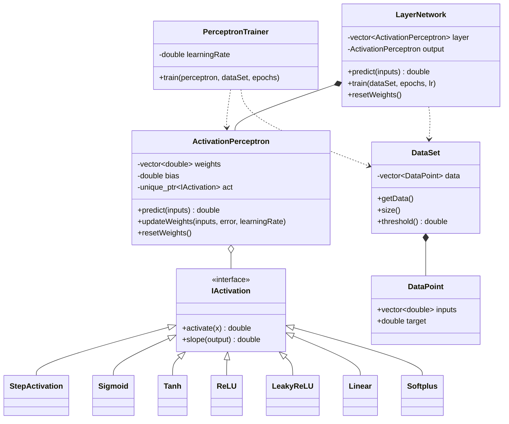

# Class Diagram

```mermaid
classDiagram
    class IActivation {
        <<interface>>
        +activate(x) double
        +slope(output) double
    }
    class StepActivation
    class Sigmoid
    class Tanh
    class ReLU
    class LeakyReLU
    class Linear
    class Softplus
    IActivation <|-- StepActivation
    IActivation <|-- Sigmoid
    IActivation <|-- Tanh
    IActivation <|-- ReLU
    IActivation <|-- LeakyReLU
    IActivation <|-- Linear
    IActivation <|-- Softplus

    class ActivationPerceptron {
        -vector~double~ weights
        -double bias
        -unique_ptr~IActivation~ act
        +predict(inputs) double
        +updateWeights(inputs, error, learningRate)
        +resetWeights()
    }
    class DataPoint {
        +vector~double~ inputs
        +double target
    }
    class DataSet {
        -vector~DataPoint~ data
        +getData()
        +size()
        +threshold() double
    }
    class PerceptronTrainer {
        -double learningRate
        +train(perceptron, dataSet, epochs)
    }
    class LayerNetwork {
        -vector~ActivationPerceptron~ layer
        -ActivationPerceptron output
        +predict(inputs) double
        +train(dataSet, epochs, lr)
        +resetWeights()
    }

    ActivationPerceptron o-- IActivation
    DataSet *-- DataPoint
    PerceptronTrainer ..> ActivationPerceptron
    PerceptronTrainer ..> DataSet
    LayerNetwork *-- ActivationPerceptron
    LayerNetwork ..> DataSet
```
