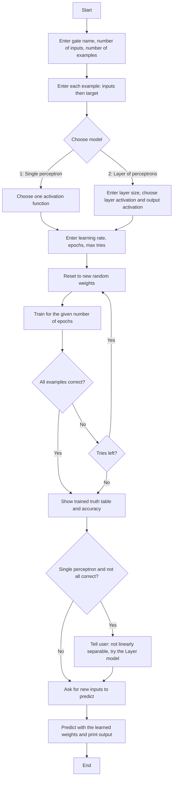
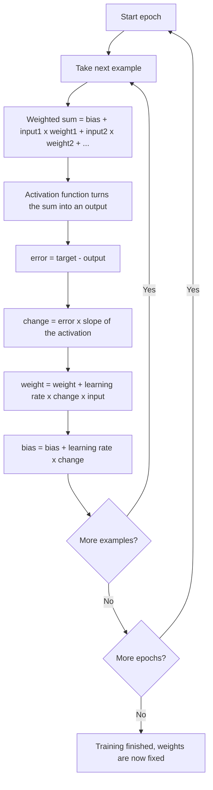
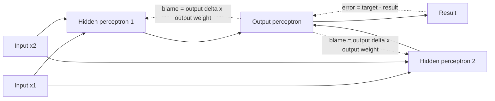
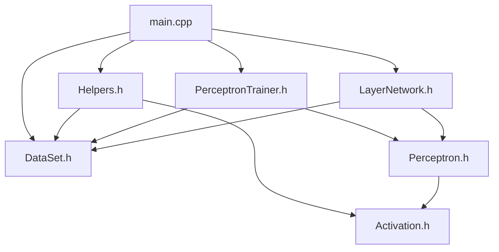
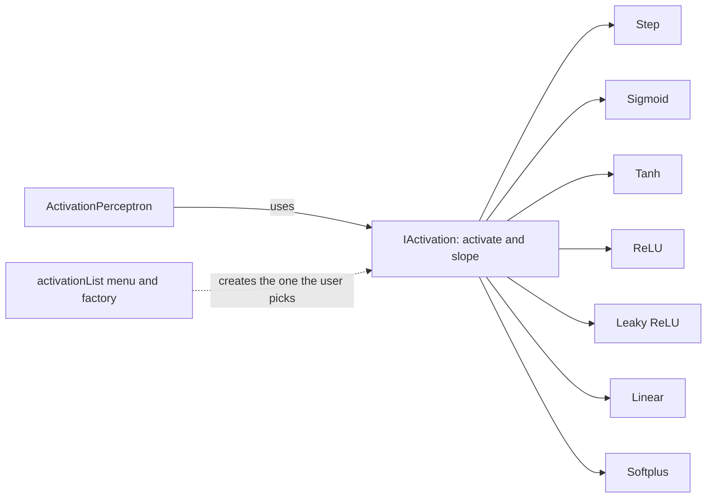

# Project Diagrams

These diagrams explain how MiniPerceptron works. They render automatically on GitHub.
The class diagram is in `CLASS_DIAGRAM.md`.

## 1. Program flow (what happens when you run it)

## 2. How one perceptron learns (training loop)

## 3. Layer network for XOR (forward and backward)

Solid arrows are the forward pass (prediction). Dotted arrows show the error going back
to update the weights. XOR needs the hidden layer because one perceptron can only draw one
straight line, and XOR cannot be split by a single line.

## 4. How the files fit together

## 5. Activation functions (Strategy pattern)

